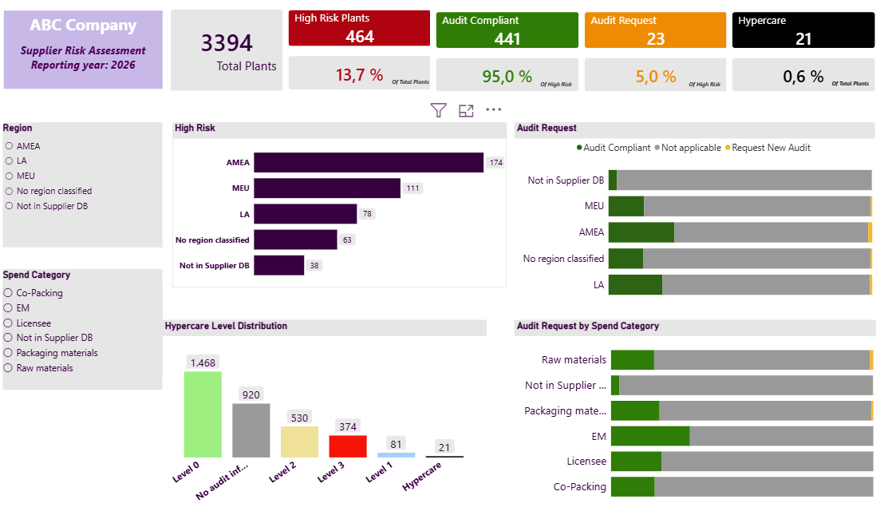

# Final Project
Project part of the ThePower course Data & Analytics V3

# Disclaimer
The dataset used in this project is based on data from a real organization, however it has been modified and anonymized for confidentiality purposes. Company names, supplier information, plant identifiers, tracker details, and other potentially sensitive information have been removed, or altered to protect the identity of the organization and its business partners.
The analysis, business rules, and dashboard presented in this project are intended solely to demonstrate data analytics and reporting techniques acquired within the Data Analyics Course V3. 

# 1. Introduction and Objectives
Company name: ABC 
  - Department: Business and Human Rights
  - Focus Area: Supplier's Audit Compliance and Risk monitoring 

The ABC’s Human Rights due Diligence (HRDD) program is designed to monitor high risk supplier plants, oversee audit compliance, and track the remediation of audit non-conformities. These non-conformities are categorized according to Hypercare levels, enabling the team to prioritize corrective actions and monitor supplier performance effectively.
This project aims to assess ABC Company's supplier plant data provided by the HRDD team.
The datasets provided by ABC serve as the foundation for this assessment and support the evaluation of supplier compliance and human rights risk management.
#### ABC’s Challenges and Solutions
For the reporting year of 2026, the HRDD team had a set a target of achieving a 98% audit completion rate across supplier plants.
Currently, the team manages multiple independent trackers to identify high-risk sites, monitor required audits, and review Hypercare cases. This fragmented approach makes it more difficult to obtain a consolidated view of supplier compliance, prioritize actions, and effectively monitor performance.

To address these challenges, this project consolidates HRDD data into an interactive dashboard that provides a single source of truth for supplier compliance. The solution enables the HRDD team to:
 - Monitor audit completion performance against the 98% target.
 - Identify high-risk supplier plants requiring audit.	
 - Track Hypercare status.
 - Prioritize outstanding actions and improve decision-making through real-time insights.
 - Reduce manual reporting and enhance operational efficiency.

# 2. Project Structure and Methodology
This project applies the data analytics techniques and best practices developed throughout the Data and Analytics course.The project followed a structured analytics workflow consisting of data preparation, exploratory analysis, and dashboard development. 
Python (Jupyter Notebook) was primarily used to perform data cleaning, transformation, integration, and Exploratory Data Analysis (EDA). This stage ensured that the datasets were validated, consolidated, and prepared according to the business rules defined by ABC.
The processed dataset was then imported into Power BI, where an interactive dashboard was developed to visualize key performance indicators (KPIs), monitor audit compliance, identify high-risk supplier plants, and analyse Hypercare levels.

This script is structured in 5 phases:
1. Data Preparation
   - Import Python libraries, and ABC's datasets. Ensure the data has been loaded correctly and is ready for analysis.
2. Data cleaning and transformation
   - Assess and prepare the datasets by resolving data quality issues, ensuring consistency across variables, standardizing formats, and applying necessary transformations to facilitate the analysis.
   Ensure to follow ABC's guidelines.
3. Data merge
   - Combine the cleaned datasets into a single dataframe.
4. Exploratory data analysis
   - Summarize the integrated dataset to identify the factors related to ABC's interests.
5. Final conclusions
   - Summarize the key findings and highlight the main insights.

### ABC Guidelines and Definitions
The analysis should apply the following criteria accross all Regions and Spend categories:

- For "In Trade", include only the following statuses: 
  - In trade 
  - Pending trade confirmation
  - Not in Supplier DB

- High risk plant definition: 
  - Membership Status: Active
  - SAQ Progress: 100% completed
  - Risk Category: High

- For high risk plants, the audit requirement is determined based on the audit date.
  - A plant is considered Compliant if it has been audited within the last three years, measured from the current year (2026).
  - A plant requires an audit if: **no audit record is available**, or the **audit was conducted more than three years ago**.

- Hypercare levels are assigned based on the number and severity of Non-Verified Non-Conformities (NCs) identified during supplier audits. Only supplier plants with a valid audit record are eligible for Hypercare classification. Plants without an audit must not be assigned a Hypercare level, as blank or zero values in the non-conformity fields may simply indicate that no audit has been performed.
  - Level 0 = 0 Non-Verified NCs (attention to empty cells or zeros appearing when no audit has been done)
  - Level 1 = 1 or more Non-Verified Minor NCs
  - Level 2 = 1 or more Non-Verified Major NCs
  - Level 3 = 1 or more Non-Verified Critical NCs
  - Level 4 = 1 or more Business Critical NCs, or a total of 25 or more Non-verified NCs  

# 3. Key Findings

This analysis evaluated 3.394 supplier plants to identify High Risk Suppliers, assess the 2026 audit compliance target, and review remediation for Hypercare plants.
Key findings include:
464 plants (13.7%) were identified as High Risk.
441 High Risk plants (95.0%) are audit compliant.
23 High Risk plants (5.0%) require a new audit.
21 plants (0.6%) are currently under Hypercare.

The AMEA region contains the largest concentration of High Risk plants.
Raw Materials remains below the client's 98% audit compliance target.

63 High Risk plants have no assigned Region and should be investigated.
Overall, the supplier base demonstrates a high level of audit compliance, indicating a postive position to achieve the 2026 target of 98%. 
It is noticed though that unresolved regional ownership and outstanding audit requirements remain key areas requiring business attention.
Although only a small proportion of plants are classified as Hypercare, these sites should continue to be closely monitored. Hypercare is not associated with a compliance target; instead, it supports the management of unresolved non-conformities and helps ensure remediation actions are completed, contributing to the long-term effectiveness of the compliance programme.

# Conclusions
This project successfully integrated multiple HRDD datasets to create a consolidated view of supplier audit compliance and Hypercare status. By applying ABC's business rules, the analysis identified the population of High Risk supplier plants, assessed audit compliance, and highlighted suppliers requiring further attention.

The results indicate that ABC is well positioned to achieve its 98% audit compliance target, with only 23 High Risk plants identified as requiring a new audit. While overall compliance is strong, the analysis also showed that supplier risk extends beyond audit completion. The analysis demonstrated that Hypercare should be considered a complementary risk indicator, as a small number of supplier plants outside the High Risk definition were also assigned Hypercare levels. This reinforces the importance of monitoring both audit compliance and outstanding non-conformities to obtain a more complete view of supplier risk.

Finally, the interactive dashboard developed as part of this project provides the HRDD team with a centralized view of supplier performance, enabling more effective monitoring of audit compliance, prioritization of remediation activities, and data-driven decision-making. The solution reduces reliance on multiple manual trackers and supports a more efficient and proactive supplier risk management process.